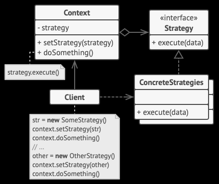

Применимость
Когда вам нужно использовать разные вариации какого-то алгоритма внутри одного объекта.
Стратегия позволяет варьировать поведение объекта во время выполнения программы, подставляя в него различные объекты-поведения (например, отличающиеся балансом скорости и потребления ресурсов).
Когда у вас есть множество похожих классов, отличающихся только некоторым поведением.
Стратегия позволяет вынести отличающееся поведение в отдельную иерархию классов, а затем свести первоначальные классы к одному, сделав поведение этого класса настраиваемым.
Когда вы не хотите обнажать детали реализации алгоритмов для других классов.
Стратегия позволяет изолировать код, данные и зависимости алгоритмов от других объектов, скрыв эти детали внутри классов-стратегий.
Когда различные вариации алгоритмов реализованы в виде развесистого условного оператора. Каждая ветка такого оператора представляет собой вариацию алгоритма.
Стратегия помещает каждую лапу такого оператора в отдельный класс-стратегию. Затем контекст получает определённый объект-стратегию от клиента и делегирует ему работу. Если вдруг понадобится сменить алгоритм, в контекст можно подать другую стратегию.
+++
Горячая замена алгоритмов на лету.
Изолирует код и данные алгоритмов от остальных классов.
Уход от наследования к делегированию.
Реализует принцип открытости/закрытости.
---
Усложняет программу за счёт дополнительных классов.
Клиент должен знать, в чём состоит разница между стратегиями, чтобы выбрать подх